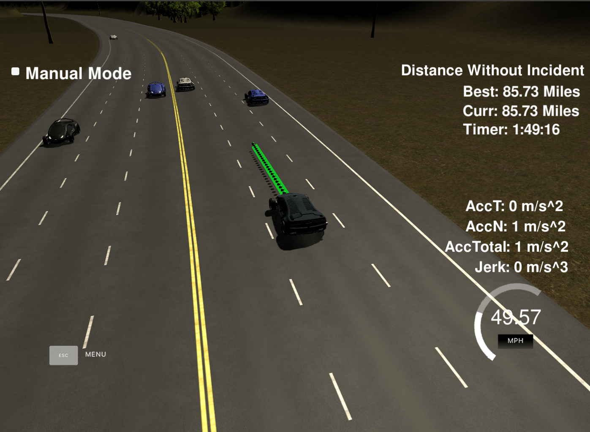
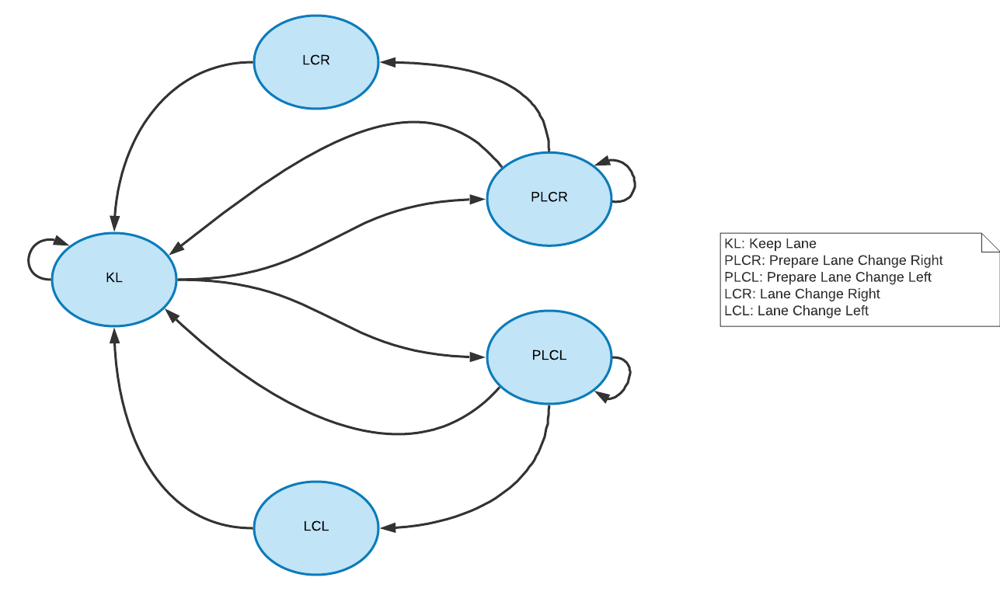

# CarND-Path-Planning-Project
Self-Driving Car Engineer Nanodegree Program



## Goals
In this project, the goal is to safely navigate around a virtual highway with other traffic that is driving +-10 MPH of the 50 MPH speed limit. The car's localization and sensor fusion data are provided, there is also a sparse map list of waypoints around the highway. The car should try to go as close as possible to the 50 MPH speed limit, which means passing slower traffic when possible, note that other cars will try to change lanes too. The car should avoid hitting other cars at all cost as well as driving inside of the marked road lanes at all times, unless going from one lane to another. The car should be able to make one complete loop around the 6946m highway. Since the car is trying to go 50 MPH, it should take a little over 5 minutes to complete 1 loop. Also the car should not experience total acceleration over 10 m/s^2 and jerk that is greater than 10 m/s^3.

## Summary of Results

I'm pretty satisfied with the results. The car can drive without any incidents. It chooses the best lane and safely changes lane. The longest test time is two hours of driving with no incidents from the start. During that time, the car drove 94 miles which gives 47 miles/hour in average speed which indicates, despite the slow traffic (30 miles/hour), the car travels almost always with maximum admissible speed which in turn means it can cope with traffic quite well.

Here are some interesting moments:

* Planning Ahead and choosing the best lane to be in [video 1](https://youtu.be/GTBbz9TJISg) [video 2](https://youtu.be/XxtEjjKk564) [video 3](https://youtu.be/Wg-z8RdT238)
* Dealing with traffic [video](https://youtu.be/wZWr-DaIufA)
* Merging [video](https://youtu.be/3HdsUaJSnLE)

## Basic Build Instructions

1. Clone this repo.
2. Make a build directory: `mkdir build && cd build`
3. Compile: `cmake .. && make`
4. Run it: `./path_planning`.

## Simulator.
The Simulator which contains the Path Planning Project can be downloaded from the [releases tab (https://github.com/udacity/self-driving-car-sim/releases/tag/T3_v1.2).  

To run the simulator on Mac/Linux, first make the binary file executable with the following command:
```shell
sudo chmod u+x {simulator_file_name}
```

## Dependencies   


* cmake >= 3.5
  * All OSes: [click here for installation instructions](https://cmake.org/install/)
* make >= 4.1
  * Linux: make is installed by default on most Linux distros
  * Mac: [install Xcode command line tools to get make](https://developer.apple.com/xcode/features/)
  * Windows: [Click here for installation instructions](http://gnuwin32.sourceforge.net/packages/make.htm)
* gcc/g++ >= 5.4
  * Linux: gcc / g++ is installed by default on most Linux distros
  * Mac: same deal as make - [install Xcode command line tools]((https://developer.apple.com/xcode/features/)
  * Windows: recommend using [MinGW](http://www.mingw.org/)
* [uWebSockets](https://github.com/uWebSockets/uWebSockets)
  * Run either `install-mac.sh` or `install-ubuntu.sh`.
  * If you install from source, checkout to commit `e94b6e1`, i.e.
```shell
    git clone https://github.com/uWebSockets/uWebSockets
    cd uWebSockets
    git checkout e94b6e1
```

## Reflection

### Ego Vehicle
The ego vehicle is defined as an object of Vehicle class [src/main.cpp line 146](./src/main.cpp#L146). This object holds the car's state at the end of planned trajectory. By using this method, the path planning can react to the sudden changes in the environment at the next time step.

### Generating Perdictions
From the sensor fusion data for other traffic, an object of vehicle is created containing frenet coordinate and speed [src/main.cpp line 129](./src/main.cpp#L129). Since other cars' speed is measured at each time step, it is assumed they travel with a constant speed. This assumption makes the prediction less noisy due to the fact that there is no need to estimate acceleration. Prediction is done for two time steps ahead: for the ego's vehicle time, and for the path planning horizon [src/main.cpp line 131](./src/main.cpp#L131). These predictions are utilized to determine the next best action in the path planning.

### Finite State Machine
At path planning core is a FSM or Finite State Machine [src/vehicle.cpp line 49](./src/vehicle.cpp#L49).



Ego vehicle object keeps the last state determined by path planning (initialized with KL)[src/main.cpp line 57](./src/main.cpp#L57). Generated predictions are fed to the state machine where this information with the current state is used to calculate the next best state.<br> First, possible next states, according to FSM diagram above, are obtained [src/vehicle.cpp line 108](./src/vehicle.cpp#L108), and optimum trajectory for each state is generated [src/vehicle.cpp line 149](./src/vehicle.cpp#L149). The optimum trajectory is also an object of vehicle class which refers to best ___acheivable___ speed, position, and state in next four seconds.<br> Acheivable means the car will not collide with any other car, does not violate speed or acceleration limit, in case of merge attempt, keeps the safe distance from other cars in both lanes.<br> Then the cost for each of these state is calculated, and trajectory for the state with minimum cost is returned. 

### Cost Functions

The cost fuctions detemines how ___satisfactory___ the current trajectory is. This is measured by how close this trajectory can get the car to the maximum speed (efficiency cost [src/cost.cpp line 144](./src/cost.cpp#L144)), how much it can avoid slow traffic (traffic avoidance [src/cost.cpp line 101](./src/cost.cpp#L101)), how much it can take the car closer to fast traffic (fastest lane [src/cost.cpp line 32](./src/cost.cpp#L32)). The effect of each cost function is tuned by weights. these weights are obtained through change-observation-reflection process.

#### Efficiency

The efficiency merit of the trajectory is measured by simply evaluating the trajectory's intended and final speed agaist the maximum speed (50 miles/hour). the cost is higher if the trajectory has lower intended and final speed [src/cost.cpp line 162](./src/cost.cpp#L162). In state selection, this cost function gives priority to the state which gives higher kinematic speed.

#### Traffic Avoidance

The cost goes higher if there can be found more cars in the intended lane and if the closest vehicle has lower speed [src/cost.cpp line 133](./src/cost.cpp#L133). the perdictions are used to count the cars in the intended lane and measure their speed. this is useful particulary when the intended lane can give maximum kinematic speed; in future (prediction horizon), however,  the ego car will encounter traffic with lower speed and has to slow down.

#### Fastest Lane

while last two cost functions assess the trajectory just in the intended and final lane, this cost function looks at the bigger picture. The cost goes higher if the intended lane is farther away from the fastest going lane [src/cost.cpp line 75](./src/cost.cpp#L75). this helps the car changes lane toward the fastest lane when driving in one of the corner lanes and the current and the adjacent lane both have low speed, but the third lane gives more speed. 

### Trajectory Generation

To connect dots between the end of generated trajectory and the planned one, [Spline](http://kluge.in-chemnitz.de/opensource/spline/) library is used [src/main.cpp line 304](./src/main.cpp#L304). First, to acheive a smooth trajectory, two points from previous path are collected and added to a list of points [src/main.cpp line 177](./src/main.cpp#L177). Three more points each 30 meters apart are added to the list which is used to setup the spline [src/main.cpp line 248](./src/main.cpp#L248). Last points use the ego car's lane; it means if the ego car decides to change lane, these new point will be the car's position in the new lane. Then new points are spaced based on the ego car's speed. also, the maximum acceleration is limited at this stage so the car doesn't violate the accerelation limit.<br>
In general, the new points are added to acheive the ego car's speed with sensible acceleration.

## Simulator Details
    
#### The map of the highway is in data/highway_map.txt
Each waypoint in the list contains  [x,y,s,dx,dy] values. x and y are the waypoint's map coordinate position, the s value is the distance along the road to get to that waypoint in meters, the dx and dy values define the unit normal vector pointing outward of the highway loop.

The highway's waypoints loop around so the frenet s value, distance along the road, goes from 0 to 6945.554.

Here is the data provided from the Simulator to the C++ Program

#### Main car's localization Data (No Noise)

["x"] The car's x position in map coordinates

["y"] The car's y position in map coordinates

["s"] The car's s position in frenet coordinates

["d"] The car's d position in frenet coordinates

["yaw"] The car's yaw angle in the map

["speed"] The car's speed in MPH

#### Previous path data given to the Planner

//Note: Return the previous list but with processed points removed, can be a nice tool to show how far along
the path has processed since last time. 

["previous_path_x"] The previous list of x points previously given to the simulator

["previous_path_y"] The previous list of y points previously given to the simulator

#### Previous path's end s and d values 

["end_path_s"] The previous list's last point's frenet s value

["end_path_d"] The previous list's last point's frenet d value

#### Sensor Fusion Data, a list of all other car's attributes on the same side of the road. (No Noise)

["sensor_fusion"] A 2d vector of cars and then that car's [car's unique ID, car's x position in map coordinates, car's y position in map coordinates, car's x velocity in m/s, car's y velocity in m/s, car's s position in frenet coordinates, car's d position in frenet coordinates. 

1. The car uses a perfect controller and will visit every (x,y) point it recieves in the list every .02 seconds. The units for the (x,y) points are in meters and the spacing of the points determines the speed of the car. The vector going from a point to the next point in the list dictates the angle of the car. Acceleration both in the tangential and normal directions is measured along with the jerk, the rate of change of total Acceleration. The (x,y) point paths that the planner recieves should not have a total acceleration that goes over 10 m/s^2, also the jerk should not go over 50 m/s^3. 

2. There will be some latency between the simulator running and the path planner returning a path, with optimized code usually its not very long maybe just 1-3 time steps. During this delay the simulator will continue using points that it was last given, because of this its a good idea to store the last points you have used so you can have a smooth transition. previous_path_x, and previous_path_y can be helpful for this transition since they show the last points given to the simulator controller with the processed points already removed. You would either return a path that extends this previous path or make sure to create a new path that has a smooth transition with this last path.

---


